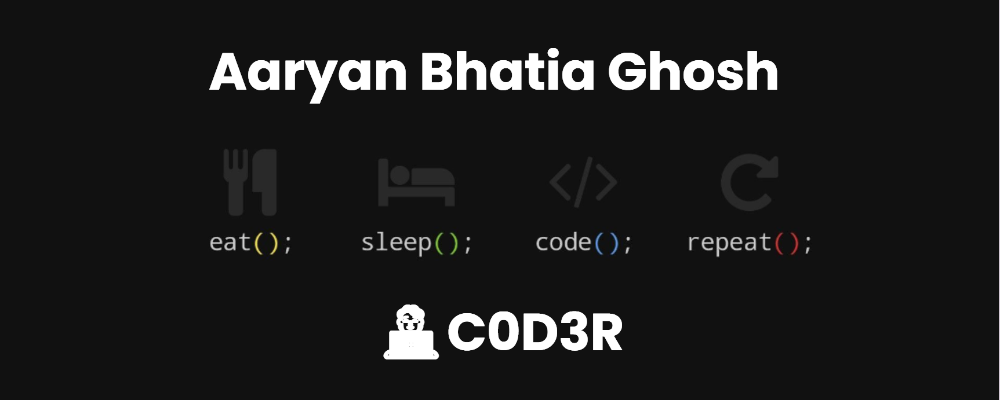

   <h1>Hi there, I'm <a href="">Aaryan Bhatia Ghosh</a>  </h1>
   
   
    

 

<h3> 🙎 Aaryan Bhatia Ghosh | 💻 Data Science Student | 🛸 New Delhi, India </h3>

   
   
 

 
 
 
 <h5 align="center">
   <i>⚡️I don’t trust people who don’t write SQL queries in uppercase⚡️</i>
  </h5>
 
 
 

  <h3> I'm 19 years old learning Full Stack Web Developer from India.</h3>

 - 🥀 Learning Data Analytics & Machine learning
 
 - <i>with Javascript, Typescript, React and 69 others.</i>
   
 - 🔭 Gaming for life, second to none😼

 - 🛸 Love technology and innovation, unending curiousity for latest tech 
 
 - I do fullstack and much of every thing :heart:
 
 - All About living life at its best.
 
 

  <h4> Full Stack | Typescript | Competitive Programming </h4>
   

<!--  -->

<!-- 

 -->

 

 ### - What i do

 

   
   

   
   
 

## &#x1f4c8; GitHub Stats

 

&nbsp;
<!--    -->

<!--  -->
   

 
 

<h1 align='center'>⚡️<i>Stay awesome!</i>⚡️</h1>
